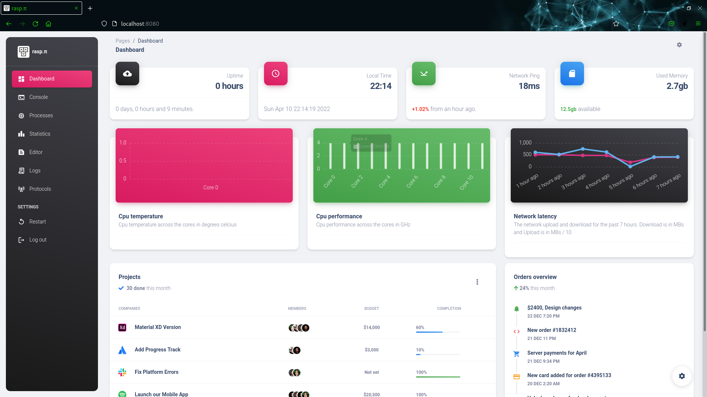
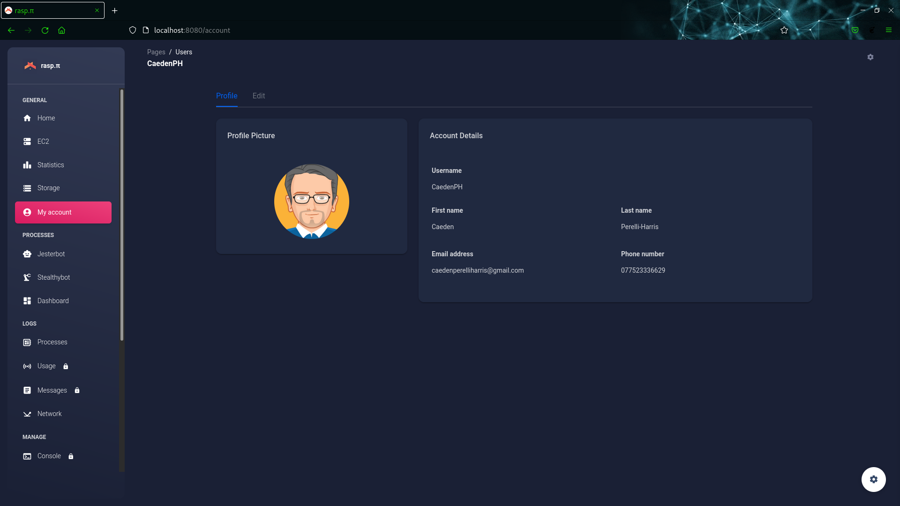
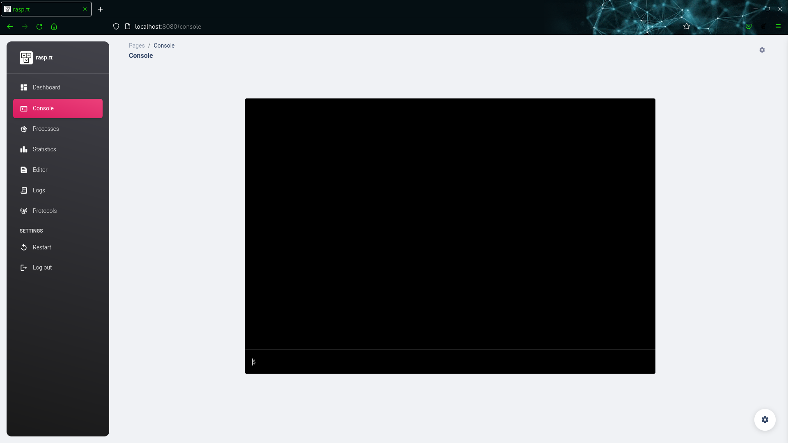
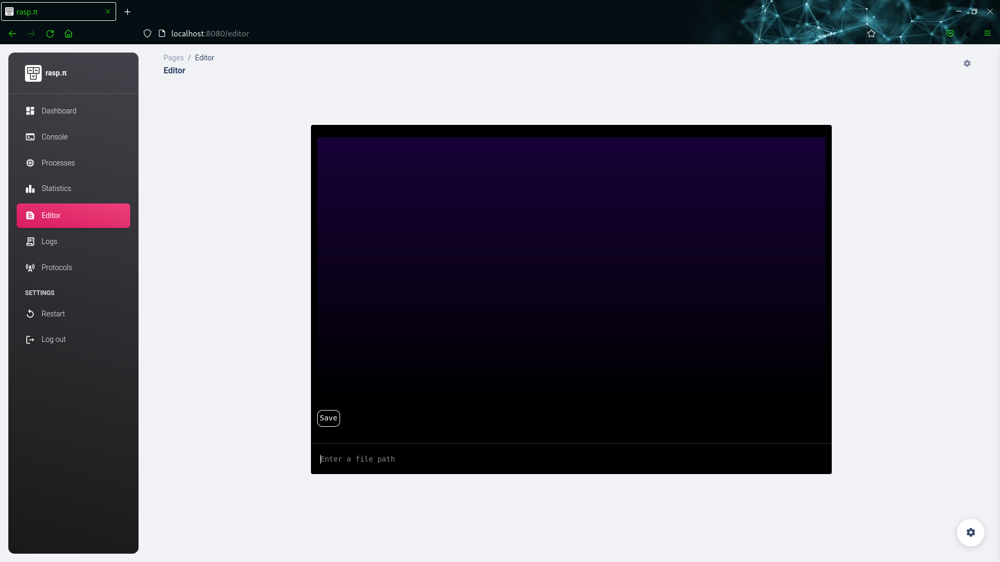

# Raspberry Dashboard
A script to generate beautiful statistics about my Raspberry Pi's status,
run tasks and manage processes.

**Examples:**
*home:*
> 
*account:*
> 
*console:*
> 
*editor:*
> 

**Special thanks:**
> [Capitalism](https://github.com/NastyPigz) for helping me with javascript

> [Ropra](https://github.com/RopraMMC) for helping me with css